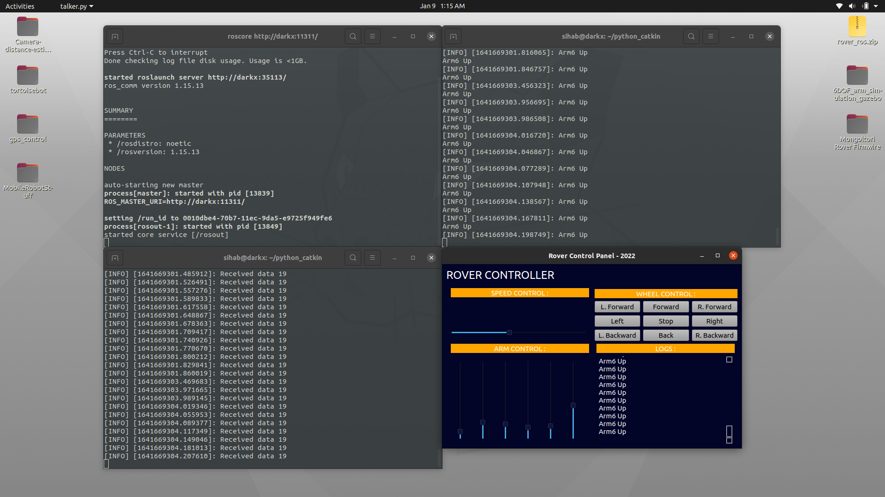

# ROVER-GUI-PyQt5
A general QT based UI for Robot Control System using ROS Noetic.
# Dependencies Installation

```
http://wiki.ros.org/Installation/Ubuntu
```
```
pip3 install --user pyqt5  
sudo apt-get install python3-pyqt5  
sudo apt-get install pyqt5-dev-tools
sudo apt-get install qttools5-dev-tools
```
# Test the Package
Package Name : tutorials 
1. Goto your workspace and src folder. 
2. Clone this repository and cd .. then catkin_make
3. Open 3 terminals and run one by one on those terminal.
```
roscore
rosrun tutorials listener.py
rosrun tutorials talker.py 
```
# Screenshot

